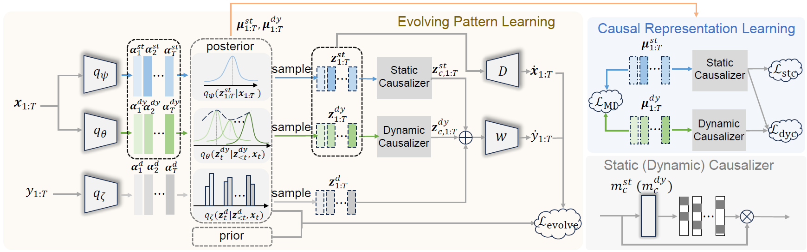

-------

<div align="center">    

# Learning Time-Aware Causal Representation for Model Generalization in Evolving Domains

[ICML 2025] Official Code of **SYNC** 

[Zhuo He](https://scholar.google.com/citations?user=425tWzMAAAAJ&hl=en), [Shuang Li](https://shuangli.xyz), [Wenze Song](https://openreview.net/profile?id=~Wenze_Song1), [Jian Liang](https://scholar.google.com/citations?user=mrunnpoAAAAJ&hl=zh-CN), [Han Li](https://scholar.google.com/citations?user=IJGli9AAAAAJ&hl=en), [Kun Gai](https://scholar.google.com/citations?user=PXO4ygEAAAAJ) 

[](https://openreview.net/forum?id=KhCKypSaqx) &nbsp;&nbsp;
[](https://icml.cc/media/PosterPDFs/ICML%202025/45628.png?t=1751534496.7289999) &nbsp;&nbsp;



<div align="left">    

## Contributions

- By taking a novel causal perspective towards EDG problem, we design a time-aware SCM that enables the refined modeling of both dynamic causal factors and causal mechanism drifts. After that, we propose **S**tatic-D**YN**amic **C**ausal Representation Learning (**SYNC**), an approach for effectively learning time-aware causal representations, thereby mitigating spurious correlations.
- Theoretically, we show that SYNC can build the optimal causal predictor for each time domain, resulting in improved model generalization.
- Results on both synthetic and real-world datasets, along with extensive analytic experiments demonstrate the effectiveness of proposed approach.

## Prerequisites Installation

The code is implemented with `Python 3.8.18` and run on `NVIDIA GeForce RTX 4090`. To try out this project, it is recommended to set up a virtual environment first.

```
# Step-by-step installation
conda create -n sync python=3.8.18
conda activate sync

# install torch, torchvision and torchaudio
conda install pytorch==1.12.1 torchvision==0.13.1 torchaudio==0.12.1 cudatoolkit=11.6 -c pytorch -c conda-forge

# this installs required packages
pip install -r requirements.txt
```

## Datasets Preparation

All datasets are available for download [here](https://github.com/WonderSeven/LSSAE).

## Code Running

```
# running for Circle dataset:
bash scripts/train_circle_sync.sh

# running for Sine dataset:
bash scripts/train_sine_sync.sh

# running for RMNIST dataset:
bash scripts/train_rmnist_sync.sh

# running for Portraits dataset:
bash scripts/train_portraits_sync.sh

# running for Caltran dataset:
bash scripts/train_caltran_sync.sh

# running for PowerSupply dataset:
bash scripts/train_power_sync.sh

# running for ONP dataset:
bash scripts/train_onp_sync.sh
```

## Acknowledgments

This project is mainly based on the open-source project: [DomainBed](https://github.com/facebookresearch/DomainBed) and [LSSAE](https://github.com/WonderSeven/LSSAE). We thank the authors for making the source code publicly available.
